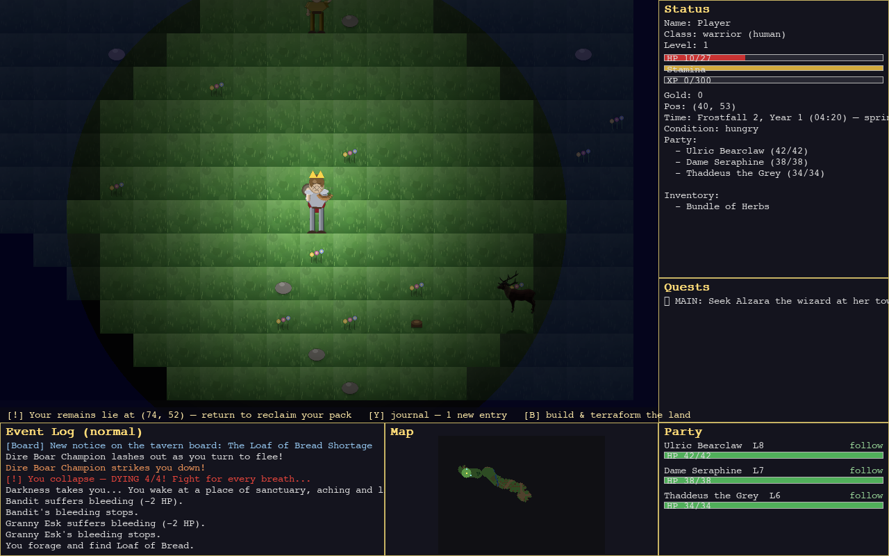
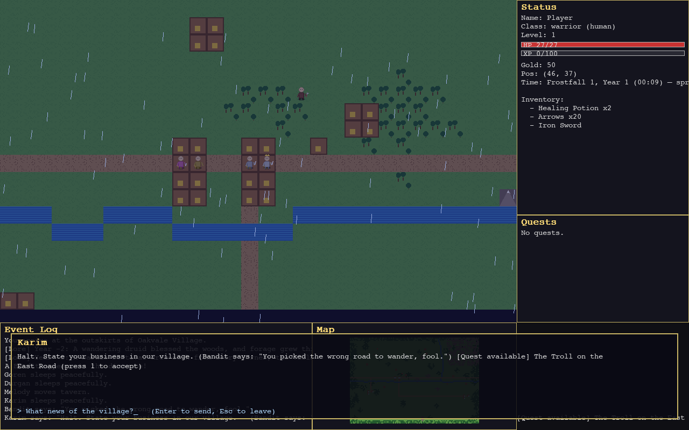
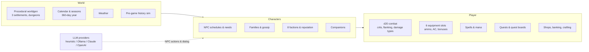
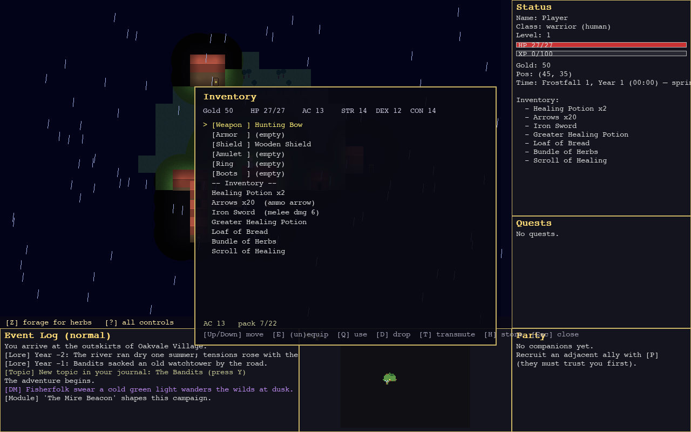
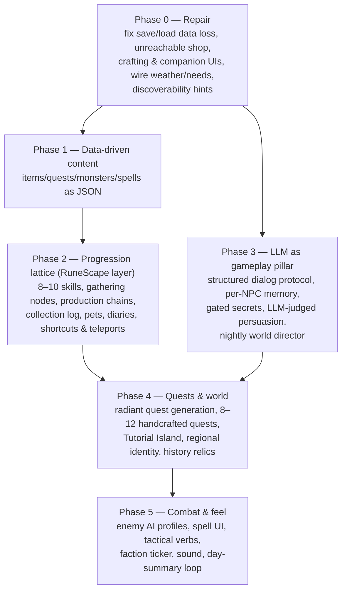

# LLM-RPG

**A locally-runnable, D&D-style role-playing game with LLM-powered NPCs.**
Runs entirely offline out of the box (a heuristic AI keeps the world alive), and
plugs into Ollama, Anthropic Claude, or OpenAI for richer NPC minds.


*Exploring Oakvale Village in the rain: procedural sprites, day/night lighting,
live minimap, event log with world lore from the pre-game history simulation.*

```bash
pip install -r requirements.txt
python main.py                                  # Pygame GUI, no LLM needed
python main.py --provider anthropic --model claude-haiku-4-5-20251001
```

---

## The game today

A living-world sandbox on a 120×80 tile map: three settlements (Oakvale Village,
Riverside Hamlet, Stonepine Camp) joined by roads, wilderness, caves that descend
into procedural dungeons, and ~11 named NPCs with families, schedules, needs, and
gossip.


*Talking to Karim the guard — free-text conversation, with quest offers surfaced
inline. Making dialog mechanically deep is the core of the development plan below.*

### Systems overview




*The inventory overlay: worn equipment slots up top, scrollable bag below.*

### What's under the hood

| | |
|---|---|
| Engine | Python + pygame, single process, no asset files (procedural sprites) |
| Codebase | ~19k lines, all modules < 500 lines, dependency-injected subsystems |
| Tests | 247 unit tests across 44 files |
| Combat | 1d20 + ability mod + proficiency vs AC; nat-20 crits, flanking, silver/fire/holy damage types |
| World | Chunk-streamed 120×80 map, BSP dungeons, weather, foraging, interiors |
| NPCs | Class schedules (work/eat/drink/sleep), hunger & fatigue, families, gossip, faction reputation |
| LLM layer | Pluggable providers; the default heuristic needs no LLM at all |

### An honest status note

A July 2026 audit found that several built systems are **not yet wired to the
player** (shop/crafting/companion UIs, some save/load state) and the LLM currently
produces flavor text rather than driving game mechanics. Fixing that wiring is
Phase 0 of the plan below — this branch (`v2-development`) is where that work
happens, in small tested increments.

---

## The plan: from tech demo to professional RPG

Full detail in [`DEVELOPMENT_PLAN.md`](DEVELOPMENT_PLAN.md). It was built from a
line-level code audit plus design research into Old School RuneScape, Stardew
Valley, Caves of Qud, Kenshi, and shipped LLM-NPC games (Suck Up!, Dead Meat,
1001 Nights, the Generative Agents paper).



### The three design pillars

1. **A RuneScape-style progression lattice.** Many parallel skill tracks with a
   geometric XP curve and an unlock every few levels; gather → process → consume
   chains in a closed "Ironman" economy where combat eats food, ammo, and potions;
   collection log, skilling pets, and regional achievement diaries for long-tail
   goals.
2. **LLM NPCs that matter mechanically.** *Engine owns truth, LLM owns voice*:
   structured JSON dialog actions, secrets held as gated tokens (immune to prompt
   injection by construction), persuasion checks the LLM adjudicates against your
   CHA with real stakes, per-NPC retrieval memory that survives saves, and one
   nightly "director" call that spawns world events instead of costly per-NPC
   simulation.
3. **A handcrafted world worth exploring.** Quests whose rewards are capability
   unlocks (teleports, shortcuts, access) rather than XP; a Tutorial Island of
   LLM instructor NPCs; history simulation that leaves relics, ruins, and grudges
   you can actually find.

### Milestones

| Milestone | Delivers |
|---|---|
| **M1 Repair** | Everything advertised actually works, zero save-data loss |
| **M2 Foundation** | All content data-driven (JSON), scaling unblocked |
| **M3 Progression** | 10+ hours of self-directed skill/collection play |
| **M4 The Pillar** | Talk your way into secrets, discounts, quests, and out of fights |
| **M5 The World** | Radiant + handcrafted quests, tutorial, themed regions |
| **M6 Polish** | Tactical combat, spell UI, sound, day-loop hooks |

---

## Quick start

```bash
python3 -m venv .venv && .venv/bin/pip install -r requirements.txt
.venv/bin/python main.py                        # GUI, heuristic NPCs (no LLM)
.venv/bin/python main.py --ui terminal          # terminal mode
.venv/bin/python main.py --provider ollama --model llama3
.venv/bin/python main.py --provider anthropic --model claude-haiku-4-5-20251001
.venv/bin/python main.py --load                 # resume quicksave
```

For cloud providers: `pip install anthropic` or `pip install openai` and set the
matching API key environment variable.

## Controls (GUI)

| Key | Action | Key | Action |
|---|---|---|---|
| WASD / arrows | Move | I | Inventory |
| SPACE / F | Attack | Q | Quest log |
| T | Talk to NPC | C | Character sheet |
| 1–9 (dialog) | Accept / turn in quest | Z | Forage |
| G / E | Pick up | X / V | Fireball / Heal |
| H | Drink potion | N / M | Bank deposit / withdraw |
| B | Barter with adjacent merchant | R | Ranged attack |
| TAB | Enter building / cave | F5 / F9 | Save / Load |
| F1 or `/` | Help | ESC | Close / quit |

## Development

```bash
.venv/bin/python -m unittest discover tests/    # 247 tests
```

- [`INTERFACE.md`](INTERFACE.md) — codebase navigation map (read first)
- [`DEVELOPMENT_PLAN.md`](DEVELOPMENT_PLAN.md) — the full phased plan
- [`SESSION_LOG.md`](SESSION_LOG.md) — development history
- All source files stay under 500 lines; content additions should go through the
  (upcoming) JSON data layer.

## License

MIT
