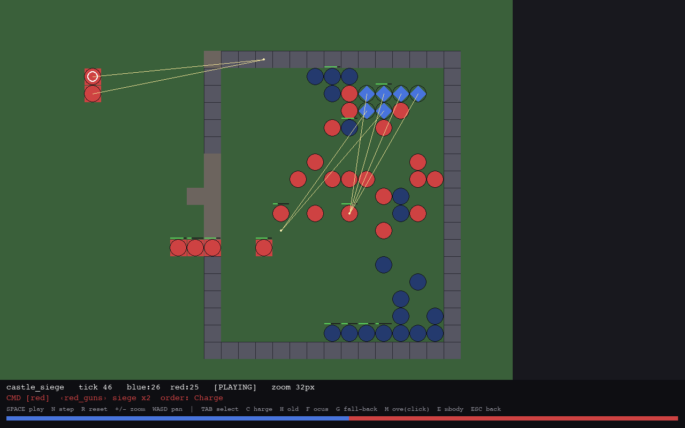

# LLM-RPG

**A locally-runnable, D&D-style role-playing game with a living world and
LLM-powered NPCs.** It runs entirely offline out of the box — a heuristic AI
keeps the whole world alive with zero API calls — and plugs into Ollama,
Anthropic Claude, or OpenAI when you want richer NPC minds.


*Oakvale in the rain: procedural sprites, eased day/night lighting and weather,
fog-of-war, a live minimap, and an event log threaded with world lore, DM beats,
and the legends of the fallen.*

```bash
pip install -r requirements.txt
python main.py                       # Pygame GUI, no LLM needed (heuristic AI)
python main.py --tutorial            # start on Tutorial Island
python main.py --provider anthropic --model claude-haiku-4-5-20251001
python main.py --ui terminal         # text UI
```

---

## What the game is today

A living-world RPG on a streaming, effectively-endless tile map. You wake near
**Oakvale Village**, and from there the world is yours: three settlements and
the Murkfen swamp joined by roads, caves that drop into procedural multi-level
dungeons, hand-built structures (a wizard's tower, a ruined keep, a seven-floor
**royal castle**), and a wilderness that gets more dangerous the stronger you
grow. A new game can even **begin at the castle** from the title screen.

Nothing here waits for you. NPCs keep daily schedules, tend needs, remember what
you did, form opinions, and — now — pursue private ambitions and drift into
friendships and feuds with each other. Factions raid and trade overnight;
villages produce goods and caravan them to where they're scarce; the gods watch
your deeds; and monsters band into packs, grow into tribes that raid the towns,
and rise into named nemeses that survive your blade and come back for revenge.

### The pillars

- **A world that lives without you.** Every night a stack of heuristic systems
  moves the world: a world director emits rumors and events, a faction ticker
  fights off-screen battles with a real army model, villages produce and trade,
  the market drifts, gods drop omens, tribes grow, ambitions advance, and the
  social graph reshapes who likes whom. All of it runs on the offline default.

- **Monsters that behave like an ecology.** Wolves hunt in packs that focus-fire
  the softest target and break when their leader falls; goblin and troll tribes
  grow in strength and raid the settlements until you beat them back; the
  wilderness scales to your party with elite champions and warbands; dragons
  breathe fire from mountain lairs; and a champion you almost kill can become a
  named **nemesis** who flees, rises in title, and hunts you for the rest of the
  campaign.

- **The LLM as a gameplay pillar, never a crutch.** All LLM features are optional
  and mirrored by a heuristic path, so the game is fully playable offline. NPC
  dialog runs a structured JSON protocol the *engine* validates; NPCs hold
  injection-proof gated secrets, remember conversations with retrieval-scored
  memory, and react to your deeds; `/persuade` `/intimidate` `/deceive` are
  judged social checks with real stakes; and an optional **Dungeon Master** layer
  plans campaign beats within a code-enforced charter.


*The Phase-17 tactical layer: squads with morale, formations, flanking arcs,
armour-vs-damage-type, siege engines and breachable walls — here a war-host
storms the castle's curtain wall.*

### Systems overview

| Area | What's in it |
|---|---|
| **Progression** | 12-skill lattice with geometric XP curves, tiered gathering & crafting, gear durability + forge repair, a collection log, skilling pets with loyalty, regional achievement diaries, quest points → guild ranks, earned teleports & Agility shortcuts |
| **Combat depth** | degrees of success, flanking & opportunity attacks, cover & true line-of-sight, ranged fidelity (ammo, aim, reload), concentration spells, weapon actions, body-part wounds, infection, dying/stabilize, a Souls-like bloodstain on death |
| **Monsters & menace** | dragons + apex tier, overworld lairs with hoards, coordinated packs, tribes that grow & raid, party-scaled elites & warbands, the Shadow-of-Mordor nemesis system |
| **The living world** | nightly world director, faction ticker with a real Lanchester army model, settlement production + caravans + market prices, five gods with favor & miracles, disease, weather, two moons & conjunctions |
| **The living society** | NPC needs & schedules, retrieval-scored memory & nightly opinions, gated secrets, bond ceremonies, heart events, a topic journal, ambitions that pay off (retire, wed, master a craft), and a peer social graph of friendships & feuds |
| **The world itself** | streaming endless regions, destructible tiles & breachable walls, fire/oil/water/blood surfaces, floods, giants that smash & rebuild, environmental traversal (wade/swim/climb/dive) with a breath clock, claimable homes, a pack mule |
| **Set-pieces** | multi-level buildings & dungeons, boss fights with telegraphed AoE & phases, a seven-floor royal castle with a living court and an intrigue questline, on-screen and off-screen sieges |
| **The Dungeon Master** | a typed, budgeted, charter-checked command set; one planning call per game-day; a persistent Legendarium of everything created and everything slain |
| **Multiplayer & agents** | a transport-free client/world contract with an optional TCP wire; agent-driven heroes that play through the real player API; an away-mode heartbeat |


*The I-panel: equipment, bags, and use/equip/drop — the character screen the game
drives from data.*

---

## Controls (GUI)

**Move & explore** — `WASD`/arrows walk (a map edge streams a new region);
`Numpad 1-9` walk in 8 directions; `SHIFT+move` disengage; `TAB` enter/leave a
building or cave; `SHIFT+TAB` force a locked door; `L` look, `SHIFT+L` event-log
detail; `ENTER` sleep at an inn or camp outdoors.

**Fight** — `SPACE`/`F` melee; `R` ranged, `SHIFT+R` aimed shot; `[` `]` cycle
target; `SHIFT+F` shove; `SHIFT+V` weapon action; `SHIFT+T` trip; `SHIFT+I`
demoralize; `SHIFT+B` feint; `SHIFT+H` battle medicine; `X` spellbook, `V`
quick-Heal; `H` drink a potion.

**People & world** — `T` talk (`/persuade` `/intimidate` `/deceive`); `B` barter;
`G`/`E` pick up · use furniture · dig; `SHIFT+G` carry a downed body; `Z` forage
/ harvest; `SHIFT+Z` treat your pet; `P` party; `SHIFT+P` pray; `K` craft;
`N`/`M` bank; `1–5` answer a confronting guard.

**Panels** — `I` inventory & gear · `C` character · `Q` quests · `O` collection
· `J` diaries · `U` travel · `Y` topic journal · `,` settings · `F1`/`?` help ·
`F5`/`F9` quicksave/quickload · `F11` fullscreen · `ESC` close.

---

## Playing "The Sunken Tome of Vael'Zhur" (the built-in adventure)

A themed side-campaign is woven into every new game. At the start you'll hear a
rumor — *"Fisherfolk speak of a drowned green light in the southern Mirefen
marsh — and of the scholar Ondrel there."* That's your cue:

1. **Travel south/south-east** to the **Mirefen** marsh (a good stretch out).
2. **Talk to Sage Ondrel** (`T`) — he gives *The Whisper Beneath the Marsh*:
   find the **Drowned Vault**.
3. **The Scattered Keys** — recover the three **Warding-Key fragments** from
   the **Thornwatch Ruins**, the **Ashen Camp**, and **Ysolde's Hollow** (each
   guarded — fight for them), and bring them back to Ondrel, who forges the
   **Warding Key**.
4. **The Drowned Sanctum** (from **Warden Halric**) — descend the Vault's three
   flooded, sigil-warded levels and face **Vael'Zhur the lich** at his altar.
5. **Decide the Tome's fate** — at turn-in, choose to **Seal**, **Destroy**, or
   **Claim** it. Each ending writes its own line into the Chronicle (`Y`).

Tip: the Vault is dark — grab the **Drowned Lantern** from the first chest, and
the **Tidecaller's Signet** helps you cross the flooded halls.

---

## Development

- **Branch:** work happens on `v2-development` in small, tested rounds; every
  green round is committed **and** pushed.
- **Tests:** `.venv/bin/python -m unittest discover tests/` — **1950+** unit
  tests, kept green. Content is validated with
  `.venv/bin/python -m items.data_validate` after any `data/` edit.
- **Navigation:** read **[`INTERFACE.md`](INTERFACE.md)** first — it maps every
  module. **[`DEVELOPMENT_PLAN.md`](DEVELOPMENT_PLAN.md)** holds the phased plan;
  **[`SESSION_LOG.md`](SESSION_LOG.md)** narrates every round.
- **Content is data, not code.** Items, recipes, spells, monsters, quests, NPCs,
  skills, structures, lairs, tribes and more live in `data/*.json`. New content
  is a JSON edit plus a validator pass — never a re-hardcode.
- **File-size rule:** every source file stays under 500 lines; modules are split
  before they grow past it.

### Status

Phases 0–18 are complete (repair → progression → the LLM pillar → quests & world
→ combat depth → the Dungeon Master → conflict → autonomous-world imports →
living buildings → destructible world → traversal → the rules of living →
advanced graphics → the living economy → the tactical battle layer → the royal
castle). **Phase 19 (Monsters & Menace)** — dragons, lairs, packs, tribes,
elites, the nemesis — is complete. **Phase 20 (the Living Society & the Gods)**
is in progress. See `DEVELOPMENT_PLAN.md` for what's next.

## Requirements

Python 3.12, `pygame`, `numpy`, `pytest` (see `requirements.txt`). No network is
required to play — LLM providers are strictly opt-in.

## License

See repository for license details.
