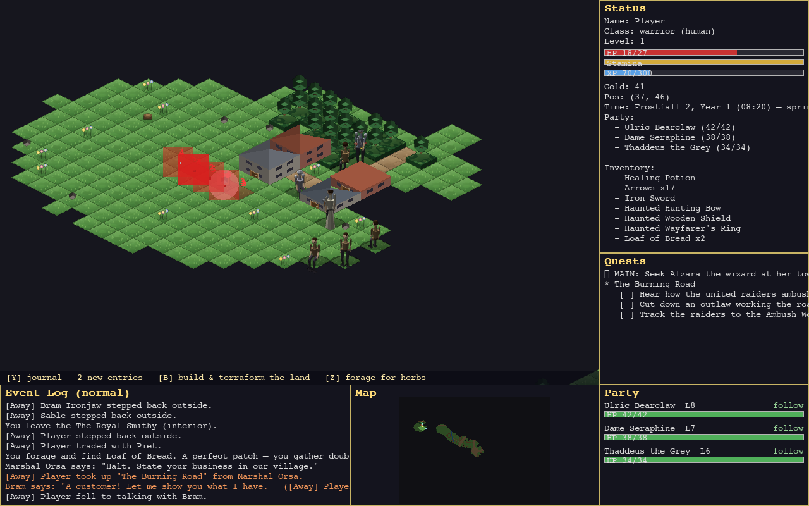
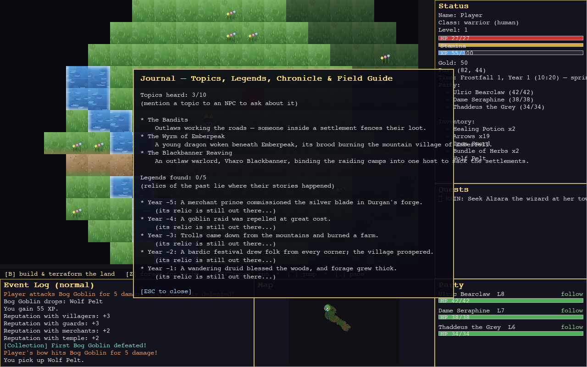

# LLM-RPG

**A locally-runnable, D&D-style role-playing game with a living world, LLM-powered
NPCs, and heroes that adventure on their own.** It runs entirely offline out of the
box — a heuristic AI keeps the whole world alive with zero API calls — and plugs
into Ollama, Anthropic Claude, or OpenAI when you want richer NPC minds.

> **This project is an *introduction* to building a role-playing game with an
> LLM** — a working, playable reference you can read, run, and learn from. It's
> deliberately structured so the ideas are legible: content lives in `data/*.json`,
> every module is mapped in [`INTERFACE.md`](INTERFACE.md), the LLM is a pillar
> that's *always* mirrored by an offline heuristic, and each source file stays
> under 500 lines. It is still evolving in the open — see *Current state* below.


*The default top-down view: the away-hero has gathered a **band** (Ulric L8, Dame
Seraphine L7, Thaddeus L6, following on the party panel) and taken up an adventure
questline — procedural sprites, eased day/night lighting and weather, fog-of-war, a
live minimap, and an event log threaded with combat, loot, and world lore.*

```bash
pip install -r requirements.txt
python main.py                       # Pygame GUI, no LLM needed (heuristic AI)
python main.py --tutorial            # start on Tutorial Island
python main.py --provider anthropic --model claude-haiku-4-5-20251001
python main.py --ui terminal         # text UI
```

---

## What the game is today

A living-world RPG on one big map (240×170) with a single entry point. You wake on
the **Oakvale** arrival waystone — a large, walled, multi-district procedural town of
~170 townsfolk — and from there the world is yours: a countryside of farming
villages, a **Bloodstone Castle** (a seven-floor keep with a living court) at a far
corner, caves that drop into a shared deep dungeon, wilderness lairs, guild halls,
and **five hand-authored adventures** seeded across the land. The wilds get more
dangerous the further you go.

Nothing here waits for you. NPCs keep daily schedules, tend needs, remember what you
did, form opinions, pursue private ambitions, and drift into friendships and feuds.
Ordinary townsfolk take **ventures** — a pilgrimage, a trade run, a visit to kin —
and come home with road-tales. Factions raid and trade overnight; villages produce
goods and caravan them to where they're scarce; the gods watch your deeds; monsters
band into packs, grow into tribes that raid the towns, and rise into named nemeses.
And **the world's other heroes go adventuring too** — rival adventurers set out to
clear the same adventures you might, and beat you to them if you dawdle.


*The optional isometric renderer (Phase 41): the same world in a baked-3D 2:1 view —
3D buildings, trees, characters and furniture, interior lighting, day-night + weather.
The party follows in iso too; the classic top-down view stays the default.*

### The pillars

- **A world that lives without you.** Every night a stack of heuristic systems moves
  the world: a director emits rumors and events, a faction ticker fights off-screen
  battles with a real army model, villages produce and trade, the market drifts, gods
  drop omens, tribes grow, ambitions advance, the social graph reshapes who likes
  whom, townsfolk set out on ventures, and rival heroes take on adventures. All of it
  runs on the offline default.

- **Monsters that behave like an ecology.** Packs focus-fire the softest target and
  break when their leader falls; goblin and troll tribes grow and raid until you beat
  them back; the wilderness scales to your party with elite champions and warbands;
  dragons breathe fire from mountain lairs; and a champion you almost kill can become
  a named **nemesis** who flees, rises in title, and hunts you for the rest of the
  campaign.

- **The LLM as a gameplay pillar, never a crutch.** All LLM features are optional and
  mirrored by a heuristic path, so the game is fully playable offline. NPC dialog runs
  a structured JSON protocol the *engine* validates; NPCs hold injection-proof gated
  secrets, remember conversations with retrieval-scored memory, and react to your
  deeds; `/persuade` `/intimidate` `/deceive` are judged social checks; and an optional
  **Dungeon Master** layer plans campaign beats within a code-enforced charter.

- **Heroes that live their own lives.** Any hero can be handed to an autonomous,
  LLM-free controller — for co-op, for the world's rival adventurers, or for *your*
  hero when you step away. A driven hero explores, talks, **recruits a capable band**,
  takes on quests and adventures, fights with its party (a wizard leads with magic,
  nuking tough foes and blasting clusters), and comes home — and a "While You Were
  Away" digest tells you what it got up to.


*The Phase-17 tactical layer: squads with morale, formations, flanking arcs,
armour-vs-damage-type, siege engines and breachable walls — here a war-host storms
the castle's curtain wall.*

### Systems overview

| Area | What's in it |
|---|---|
| **Progression** | 12-skill lattice with geometric XP, tiered gathering & crafting, gear durability + forge repair, magic-item enchanting, a collection log, skilling pets, achievement diaries, quest points → guild ranks, a training/level-up system, earned teleports |
| **Combat depth** | degrees of success, flanking & opportunity attacks, cover & true line-of-sight, ranged fidelity (ammo, aim, reload), concentration spells, weapon actions, body-part wounds, infection, dying/stabilize, a Souls-like bloodstain on death |
| **Magic & worldcraft** | 51 spells across schools & tiers, world-altering spells that reshape terrain, shapeshifting (willing & cursed), necromancy & the undead, a unified worldcraft mutation layer, protection-by-power wards, a player build/terraform tool with saveable blueprints |
| **Monsters & menace** | dragons + apex tier, overworld lairs with hoards, coordinated packs, tribes that grow & raid, party-scaled elites & warbands, the Shadow-of-Mordor nemesis system, monster goals & tribal agendas |
| **The living world** | nightly world director, faction ticker with a real Lanchester army model, settlement production + caravans + market prices, five gods with favor & miracles, disease, weather, two moons & conjunctions |
| **The living society** | NPC needs & schedules, retrieval-scored memory & nightly opinions, gated secrets, bond ceremonies, heart events, a topic journal, ambitions that pay off, a peer social graph of friendships & feuds, and townsfolk who venture out and trade |
| **The living heroes** | agent-driven co-op & away-heroes, rival adventurers & companies that clear adventures off-screen, a recruit-a-band → take-a-quest → adventure loop, a rich away-return digest |
| **The world itself** | one big combined map, streaming endless regions, destructible tiles & breachable walls, fire/oil/water/blood surfaces, floods, giants, traversal (wade/swim/climb/dive) with a breath clock, claimable homes, a data-driven mount roster with stables |
| **Set-pieces & adventures** | multi-level buildings & dungeons, boss fights with telegraphed AoE & phases, a seven-floor royal castle with an intrigue questline, **five authored adventures** with branching finales that reshape the world |
| **The Dungeon Master** | a typed, budgeted, charter-checked command set; one planning call per game-day; a persistent Legendarium of everything created and everything slain |

---

## The built-in adventures

Every new game seeds a set of **authored, multi-act adventures** across the world —
each with its own cast (kept out of the general roster), clue items, guarded sites,
a named boss, and a **branching finale** that *reshapes the world* (the threat's
guardians disperse, its wilderness spawns thin, and a lasting beat enters the
Chronicle). A rumor points you toward each; the **Y-journal** lists them as *Adventure
Leads* (open / underway / a rival closing in / ended) with a compass bearing.

| Adventure | Theme | The arc |
|---|---|---|
| **The Sunken Tome of Vael'Zhur** | drowned / undead | a 5-act guided questline into a flooded, sigil-warded vault to face a lich — Seal, Destroy, or Claim the Tome |
| **The Wyrm of Emberfell** | dragon | a mountain village raided by a wyrm's brood → the scholar who knows its weakness → **Cindermaw** at its roost — Slay, Drive-off, or Bargain |
| **The Blackbanner Reaving** | outlaw war | a warlord binds the raiding camps into one host → a swayable lieutenant → **Vharo Blackbanner** — Kill, Turn-the-captains, or Seize-the-banner |
| **The Hex of Wychwood** | witch / curse | a green hag hollows a woodland hamlet into beasts → the hedge-witch's counter-charm → **Mother Yall** — Kill, Bind-and-free, or Take-the-greenstaff |
| **The Hollowing of Ravenmoor** | barrow undead | a grave-robber wakes a barrow-wight that hollows the living → **Aedelric** — Destroy, Lay-to-rest, or Claim-the-crown |

New adventures are pure **data** — a JSON file (areas, cast, clues, foes, rumor,
`resolved` beat) plus a three-line registration, via the reusable `AdventureSeeder`.


*The `Y` journal: topics you've heard (ask an NPC about them), the legends of relics,
the running Chronicle of the age, a self-teaching Field Guide, and the live Adventure
Leads.*

---

## How to play

1. **Install & launch** — `pip install -r requirements.txt` then `python main.py`.
   A title screen offers **New Game** (a character creator: race, class, stats),
   **Load**, and **Tutorial Island**. No API key or network is needed.
2. **Find your feet in Oakvale** — you start safe on the arrival waystone in the big
   walled town. `WASD`/arrows to walk; `T` to talk; `B` to barter; `I` inventory;
   `C` your character hub; `F1`/`?` for the full controls. The **hint bar** always
   tells you which keys do something right here.
3. **Gather a band & take a quest** — recruit adventurers at the guild halls and
   accept quests from NPCs or the tavern board, then head into the wilds. It gets
   **more dangerous the further you go** — fight deliberately, use cover, retreat when
   outmatched, and lean on your party.
4. **Grow through gear & allies, not grinding** — power comes from better weapons and
   armour (crafted, looted, enchanted) and from **companions**; the XP climb is
   intentionally slow. Rest at inns or camp; bank your gold; train skills by *doing*.
5. **Follow the adventures** — the `Y`-journal's *Adventure Leads* point you at the
   five authored questlines. Hurry — a rival hero may clear one first.
6. **Or step away** — hand your hero to the autoplay agent (an *away* mode) and it
   lives a full life while you watch or return to a digest of its deeds.

Prefer text? `python main.py --ui terminal`. Want a 3D look? Toggle the renderer to
**iso** in Settings (`,`). Learning by doing? `python main.py --tutorial`.

## Controls (GUI)

**Move & explore** — `WASD`/arrows walk; `Numpad 1-9` walk in 8 directions;
`SHIFT+move` disengage; `TAB` enter/leave a building or cave *at a door/stair*;
`SHIFT+TAB` force a locked door; `L` look, `SHIFT+L` event-log detail; `ENTER` sleep
at an inn or camp; `E`/`G` use a door · furniture · waystone · stable.

**Fight** — `SPACE`/`F` melee; `R` ranged, `SHIFT+R` aimed shot; `[` `]` cycle target;
`SHIFT+F` shove; `SHIFT+V` weapon action; `SHIFT+T` trip; `SHIFT+I` demoralize;
`SHIFT+B` feint; `SHIFT+H` battle medicine; `X` spellbook (`SHIFT+1-5` favourite a
slot); `1-5` **quick-cast** a slotted spell; `V` quick-Heal; `H` drink a potion.

**People & world** — `T` talk (`/persuade` `/intimidate` `/deceive` `/court` `/bond`);
`B` barter; `Z` forage / harvest; `SHIFT+Z` treat your pet; `P` party; `SHIFT+P` pray;
`K` craft & enchant; `N`/`M` bank; `B` build & terraform on open ground.

**Panels** — `I` inventory & gear · `C` character hub · `Q` quests · `O` collection ·
`J` diaries · `U` travel · `Y` journal · `M` world map · `,` settings · `F1`/`?` help ·
`F5`/`F9` quicksave/quickload · `F11` fullscreen · `F12` screenshot · `ESC` close.

---

## Development

- **Branch:** work happens on `v2-development` in small, tested rounds; every green
  round is committed **and** pushed, then merged to `main` at milestones.
- **Tests:** `.venv/bin/python -m unittest discover tests/` — **3,650+** unit tests,
  kept green. Content is validated with `.venv/bin/python -m items.data_validate`
  after any `data/` edit.
- **Navigation:** read **[`INTERFACE.md`](INTERFACE.md)** first — it maps every module.
  **[`DEVELOPMENT_PLAN.md`](DEVELOPMENT_PLAN.md)** holds the phased plan;
  **[`SESSION_LOG.md`](SESSION_LOG.md)** narrates every round.
- **Content is data, not code.** Items, recipes, spells, monsters, quests, NPCs,
  skills, structures, lairs, tribes, adventures and more live in `data/*.json`. New
  content is a JSON edit plus a validator pass — never a re-hardcode.
- **File-size rule:** every source file stays under 500 lines; modules are split
  before they grow past it.

### Current state

The core game is complete and richly featured, and development continues in the open.
Highlights of what's in now:

- **The foundation (Phases 0–20+)** — the 12-skill progression lattice; the
  LLM dialog/secrets/memory pillar; quests & the living world; combat depth; the
  Dungeon Master layer; conflict systems; living, destructible buildings; traversal;
  the living economy with production & caravans; the tactical battle layer; the
  seven-floor royal castle; the **Monsters & Menace** ecology; and the **Living
  Society & Gods**.
- **Magic & worldcraft** — 51 spells across schools and tiers, world-altering spells,
  shapeshifting, necromancy & a fleshed-out undead world, enchanting, a player
  build/terraform tool with cross-game blueprints, and protection-by-power wards.
- **One combined world** — a single big map entered at a large, walled, multi-district
  **Oakvale** with a living countryside, the Bloodstone Castle, a shared deep dungeon,
  and all the adventures seeded together.
- **Five authored adventures** with branching finales that reshape the world, built on
  a reusable data-driven seeder — plus **rival heroes** who go adventuring too.
- **Living heroes & autoplay** — agent-driven co-op and away-heroes that gather a
  capable band, take on quests, fight with their party (casters lead with the right
  magic), keep up with a catch-up, and return with a rich digest of their deeds.
- **World detail & graphics** — themed, prop-decorated, functionally-typed interiors;
  a per-tile textured overworld with terrain edges, 2.5D buildings with real roofs,
  facades and gates; baked-3D creatures; **and an optional full isometric renderer**.
- **Balance & feel** — a slow, gear-and-party-driven power curve; monsters that press
  the attack and hit hard; adventures whose endings quiet their threat; ridable mounts
  with stables; teleport waystones; non-blocking quick-cast; carry-raising bags.

See **[`DEVELOPMENT_PLAN.md`](DEVELOPMENT_PLAN.md)** for the full phased history and
**[`SESSION_LOG.md`](SESSION_LOG.md)** for a round-by-round narrative.

## Requirements

Python 3.12, `pygame`, `numpy`, `pytest` (see `requirements.txt`). A virtualenv is
recommended (`python -m venv .venv && .venv/bin/pip install -r requirements.txt`).
No network is required to play — LLM providers are strictly opt-in.

## License

See repository for license details.
